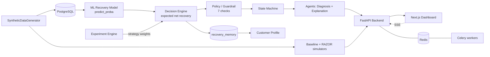

# RAZOR — Revenue AI Zero-loss Operations & Recovery

> AI decides. ML predicts. Rules protect. APIs execute. Data proves.

RAZOR is a **closed-loop revenue-recovery system** for failed payments. It ingests synthetic (or real) payment-failure events, predicts the recovery probability per strategy, chooses the best strategy subject to a policy hard gate, executes/verifies the outcome, and feeds every result back into a learning loop. It compares a simple retry **baseline** with RAZOR and reports the **incremental revenue recovered**.

**Headline: `+₹7.22L incremental revenue`** (target demo comparison) — RAZOR recovers roughly **twice** the baseline.

---

## Architecture



**Layers:** Simulation → ML prediction → Decision/Policy/State engine → Agents (diagnosis/explanation) → FastAPI API → Next.js dashboard, backed by **PostgreSQL**, **Redis**, and **Celery** workers.

---

## Tech Stack

| Layer | Tech |
|-------|------|
| Backend | FastAPI, SQLAlchemy, Alembic, Pydantic |
| ML | scikit-learn (logistic) + XGBoost (selected), joblib persistence |
| Engine | deterministic decision/policy/state machine (pure Python) |
| Async | Celery + Redis |
| Data | PostgreSQL (integer-paise money) |
| Frontend | Next.js (App Router, TypeScript, Tailwind, Recharts) |

---

## Setup

### Prereqs
- Python 3.11+, Node 18+, PostgreSQL, Redis.

### Backend
```bash
python -m venv .venv && source .venv/bin/activate
pip install -e .
cp .env.example .env            # set DATABASE_URL, REDIS_URL
alembic upgrade head             # apply migrations (incl. recovery_memory)
python scripts/seed_db.py        # idempotent demo dataset (20k)
python scripts/seed_experiment.py# idempotent demo A/B experiment
uvicorn api.main:app --reload --port 8000
```

### Dashboard
```bash
cd web
npm install
npm run dev                       # http://localhost:3000 (NEXT_PUBLIC_API_URL defaults to :8000)
```

### Async worker (optional, for real Celery)
```bash
celery -A agents.celery_app worker --loglevel=info
```

---

## Demo / Simulation

```bash
python simulate.py --events 10000          # comparison table (baseline vs RAZOR)
python scripts/demo_decision_engine.py     # policy-block + WAIT demo
python -m pytest tests/test_demo_flow.py   # 10-step killer-demo flow
```

The full 10-step demo flow (generate → at-risk → diagnose → recoverable → strategy breakdown → simulation → ₹ recovered vs baseline → drill-down → policy block → learning loop) is validated automatically in `tests/test_demo_flow.py`.

---

## API

| Method | Path | Purpose |
|--------|------|---------|
| GET | `/health` | liveness |
| GET | `/api/recovery/cases` | paginated recovery queue |
| GET | `/api/recovery/cases/{id}` | case detail + timeline |
| GET | `/api/recovery/events` | SSE live queue stream |
| GET | `/api/analytics/overview` | ₹ at risk, recovered, rate (Redis-cached) |
| GET | `/api/analytics/strategies` | per-strategy performance |
| POST | `/api/events/ingest` | idempotent event webhook |
| POST | `/api/simulation/run` | Celery async simulation → job_id |
| GET | `/api/simulation/status/{job_id}` | poll simulation result |
| GET | `/api/experiments` | A/B experiment arms |
| POST | `/api/experiments` | create experiment |
| GET | `/api/experiments/weights` | strategy weights |

All errors use a structured `{"error": {"code", "message"}}` shape.

---

## Tests

```bash
python -m pytest -q          # 69 backend tests (DB + Redis)
cd web && npm run build      # dashboard build gate
```

---

## Deployment & Submission

- **Deploy guide:** [`docs/DEPLOYMENT.md`](docs/DEPLOYMENT.md) — Vercel (frontend) + Railway (backend) + managed PostgreSQL.
- **Submission checklist:** [`docs/SUBMISSION.md`](docs/SUBMISSION.md).
- **Demo video script:** [`docs/WALKTHROUGH.md`](docs/WALKTHROUGH.md).

## Safety Principles
- **LLM is never in the money/payment execution path** (diagnosis only).
- **Policy engine is a hard gate** — always runs before any action.
- **WAIT / STOP are first-class strategies**, not failure modes.
- **All money is integer paise** — no floating point in money arithmetic.